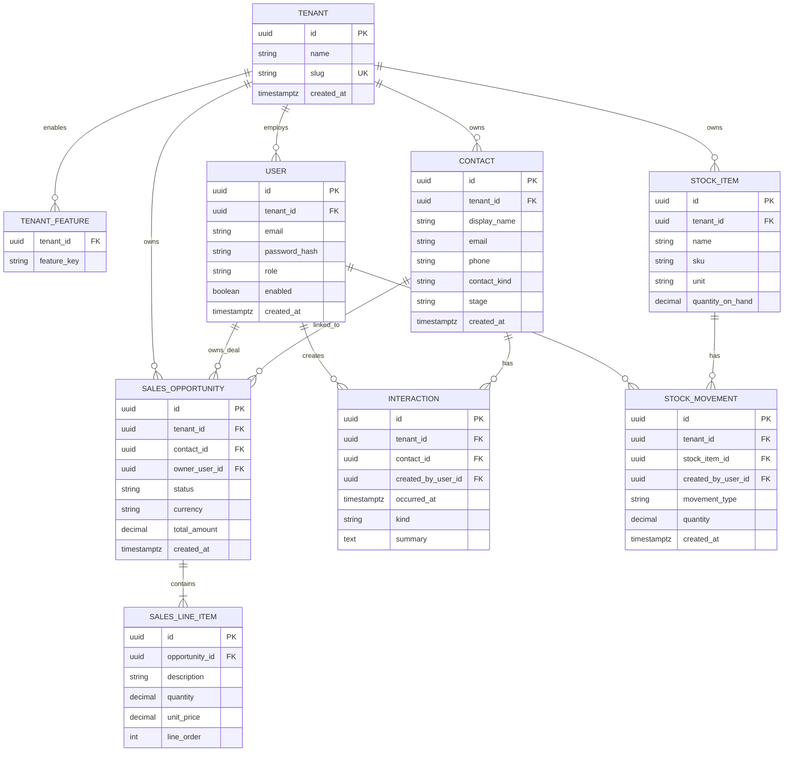
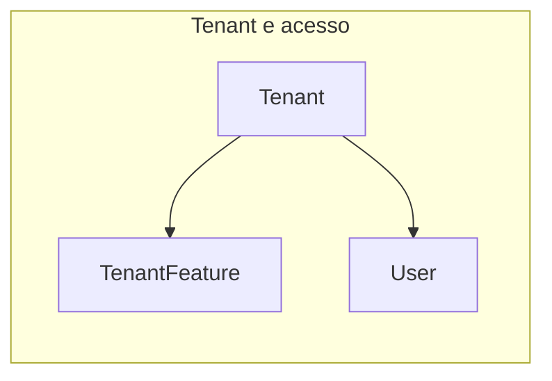
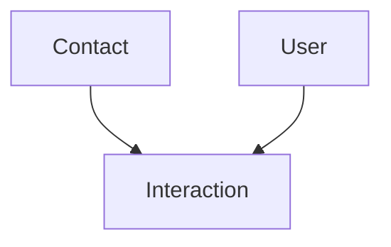
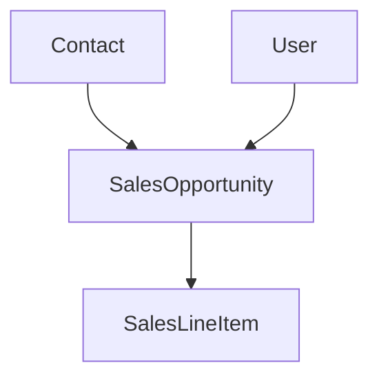
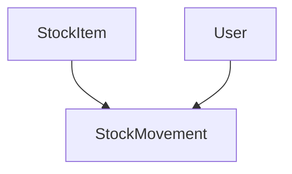

# Modelo de domínio — entidades e relacionamentos

Documento de **rascunho evolutivo** para o **`instituto-renata-be`**, alinhado ao produto em **`instituto-renata-fe/docs/SPEC.md`** (módulos §4.x, licenciamento §5) e ao contrato de sessão no **`docs/SPEC.md`** §6.

**Estado:** proposta de modelagem para discussão e para futuras migrações; nomes de tabela/coluna e cardinalidades finais podem ajustar-se na Fase 1–3 do `docs/PLAN.md`.

---

## 1. O que o sistema cobre (resumo)

| Área | Origem no FE | Ideia no domínio |
|------|----------------|------------------|
| Multi-cliente | §5 — pacotes por tenant | Cada **tenant** (consultório) tem módulos contratados (`enabledFeatures`). |
| Identidade | §4.1, §5.2 | **Utilizador** com `email`, `role` (`admin` \| `common`), pertença a um tenant. |
| CRM | §4.3 | **Contactos** (pessoas: pacientes, leads…) e **interações** (linha do tempo). |
| Vendas | §4.4 | **Oportunidades/orçamentos** com **linhas**, estado e ligação a contacto. |
| Estoque | §4.5 | **Itens** de stock e **movimentações** (entrada/saída/ajuste). |
| Marketing | §4.2 | Campanhas/metas (opcional no MVP de API; pode ficar só UI com mock até haver API). |

Não está fechado no spec do FE o detalhe clínico (ex.: prontuário, agenda); o backlog do produto (`instituto-renata-fe/docs/SPEC.md` §8) menciona evoluções — este modelo **não** as inclui salvo nota.

---

## 2. Entidades principais (conceito)

### 2.1 Núcleo multi-tenant e identidade

| Entidade | Descrição |
|----------|-----------|
| **Tenant** | Organização (consultório) que contrata o produto; isola dados por `tenant_id`. |
| **TenantFeature** | Ligação tenant ↔ módulo contratado (`marketing`, `crm`, `vendas`, `estoque`). |
| **User** (conta na aplicação) | Credenciais e `role`; pertence a um **Tenant** (MVP: um utilizador ↔ um tenant; multi-tenant por utilizador pode ser fase futura). |

### 2.2 CRM

| Entidade | Descrição |
|----------|-----------|
| **Contact** | Pessoa ou organização (paciente, lead, contato); dados cadastrais e classificação (tipo/estágio). |
| **Interaction** (atividade) | Registo na linha do tempo comercial/atendimento (nota, chamada, visita, …) associado a um contacto. |

### 2.3 Vendas

| Entidade | Descrição |
|----------|-----------|
| **SalesOpportunity** (orçamento / oportunidade) | Proposta com estado (ex.: rascunho, enviado, aceite, perdido), totais e vínculo a contacto e responsável. |
| **SalesLineItem** | Linha de item na proposta (quantidade, preço unitário, descrição). |

### 2.4 Estoque

| Entidade | Descrição |
|----------|-----------|
| **StockItem** | Material/produto (nome, SKU opcional, unidade). |
| **StockMovement** | Entrada, saída ou ajuste; quantidade e referência ao item; auditoria (quem/quando). |

### 2.5 Marketing (opcional / fase posterior)

| Entidade | Descrição |
|----------|-----------|
| **Campaign** (rascunho) | Campanha com período e metas — só se a API persistir o que hoje pode ser mock no FE. |

---

## 3. Diagrama ER — visão geral (Mermaid)

**Notas:**

- **`quantity_on_hand`** em `STOCK_ITEM` pode ser **derivada** só a partir de `STOCK_MOVEMENT` (então remove-se da tabela e calcula-se por agregação); manter coluna desnormalizada acelera listagens e exige consistência transaccional ao registar movimentos.
- **Chaves:** UUID é sugerido para expor IDs em API sem sequência previsível; alternativa: `bigint` com sequências por tenant.

---

## 4. Diagrama por módulo (simplificado)

### 4.1 Tenant, features e utilizador

- **Regra:** `feature_key` ∈ `marketing`, `crm`, `vendas`, `estoque` (espelho do `instituto-renata-fe/docs/SPEC.md` §5.1 e do contrato de sessão no `docs/SPEC.md` §6).

### 4.2 CRM

### 4.3 Vendas

### 4.4 Estoque

---

## 5. Dúvidas em aberto (para fechar com o produto)

1. **Paciente vs lead:** o FE sugere modelar por tipo ou estágio (`instituto-renata-fe/docs/SPEC.md` §4.3 nota). Decisão: campos `contact_kind` / `stage` vs entidades separadas.
2. **Um email em vários tenants:** hoje o mock assume sessão com `email` + `role` + `enabledFeatures`; definir se `User` é único globalmente ou `(email, tenant_id)` é único.
3. **Marketing:** persistir **Campaign** na mesma BD ou manter estático no FE até haver API (§4.2).
4. **Unidades e moeda:** `currency` na oportunidade; itens de stock com `unit` (unidade de medida) como texto ou catálogo.
5. **Backlog §8 do FE:** multi-unidade, prontuário, integrações — fora deste desenho inicial.

---

## 6. Ligação à documentação

| Documento | Papel |
|-----------|--------|
| `instituto-renata-fe/docs/SPEC.md` | Módulos, RBAC e features — fonte de produto. |
| `docs/SPEC.md` (backend) | Contrato HTTP, PostgreSQL, `ENV`, sessão; §3.1 e §10 impõem **manter este ficheiro** quando o modelo mudar. |
| `docs/PROMPT.md` | Regra de continuidade: actualizar **`docs/ENTITIES.md`** quando informação nova impactar entidades ou relacionamentos. |
| `docs/PLAN.md` | Fase 0 e secção **Documentação de domínio** — mesmo critério. |

**Regra:** qualquer informação (do utilizador, do spec do FE ou do código) que **altere** o entendimento de entidades, relações ou diagramas deve ser reflectida **aqui** na mesma alteração que `SPEC` / migrações / código relevante.

---

## 7. Histórico de revisões

| Data | Alteração |
|------|-----------|
| 2026-04-18 | Primeira versão: entidades propostas e diagramas ER (Mermaid). |
| 2026-04-18 | Ligação explícita a `SPEC` §3.1/§10, `PROMPT` e `PLAN` — manutenção obrigatória quando o modelo mudar. |
