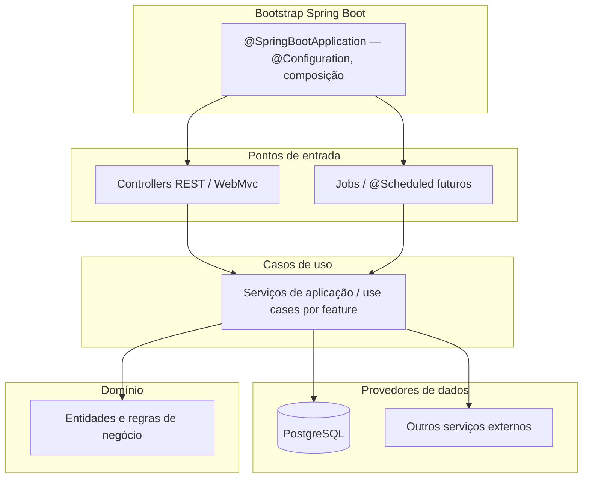

# Especificação da API (backend)

Documento vivo do repositório **`instituto-renata-be`**, alinhado ao produto em **`instituto-renata-fe/docs/SPEC.md`**. O frontend define UX e módulos; este documento define **contratos HTTP, persistência, segurança e arquitetura do servidor**.

## 1. Visão

- **Linguagem:** **Java** (versão mínima LTS e toolchain registadas em `README.md` / `pom.xml` ou Gradle; ambiente de referência do time documentada no histórico).
- **Framework:** **Spring Boot** (linha 4.x estável; alinhar versão exacta ao `README` e ao build).
- **Base de dados:** **PostgreSQL** — fonte de verdade relacional para tenants, utilizadores, domínio (CRM, vendas, estoque) e metadados de pacotes/features.
- **Função:** API REST (evolução para jobs assíncronos quando necessário) consumida pelo `instituto-renata-fe`.
- **Princípio:** regras de negócio e autorização **no servidor**; o cliente não é fonte de verdade para permissões.

## 2. Arquitetura — Clean Architecture (espírito Uncle Bob, mapeada a Spring)

O projeto segue **Clean Architecture**: dependências de código apontam **sempre para dentro** (domínio no centro). Em Spring Boot, a **inversão de dependências** concretiza-se com interfaces (ports) no núcleo da aplicação e implementações em adaptadores; o **container IoC** do Spring compõe beans na arranque.

| Camada | Papel |
|--------|--------|
| **Domínio** | Entidades, value objects e invariantes **sem** dependência de Web MVC nem de tecnologia de persistência concreta (quando possível, pacotes puros Java). |
| **Casos de uso / aplicação** | Orquestração; interfaces (ports) para repositórios e serviços externos; serviços de aplicação invocados pelos controllers. |
| **Adaptadores de entrada** | **Controllers** (`@RestController`), mapeamento HTTP/DTO → comandos dos casos de uso. |
| **Adaptadores de saída** | Implementações de repositórios (ex.: Spring Data, JDBC, clientes HTTP). |
| **Configuração** | Classe(s) de arranque, `@Configuration`, propriedades (`application*.yml`), registo de beans por **feature** (auth, CRM, vendas, estoque, …). Sem lógica de negócio nas classes de configuração. |

**Regra de dependência:** o domínio e os casos de uso **não** dependem de controllers nem de detalhes de frameworks de infraestrutura nos pacotes centrais. Testes unitários focam domínio e serviços de aplicação com dependências substituídas por mocks/fakes.

## 3. Estrutura de repositório (diretrizes)

- **Build:** **Maven** ou **Gradle** — fixar um na Fase 1 e registar no `README`.
- **Código:** árvore `src/main/java` (ou `src/main/kotlin` se no futuro se optar por Kotlin) com **pacote base** único (ex.: `com.institutorenata.api` — nome final a alinhar ao grupo Maven/artifact).
- Organização sugerida: **por feature** (ex.: `auth`, `crm`, `vendas`, `estoque`) com subpacotes `web`, `application`, `domain`, `persistence` **ou** por camada com subpacotes por contexto — decisão na Fase 1, documentada no `README`.
- **Recursos:** `src/main/resources` — `application.yml` / `application-{profile}.yml`, ficheiros de migração (Flyway/Liquibase) em `resources/db/migration` ou equivalente.

### 3.1 Modelo de domínio (referência)

- Rascunho de **entidades**, relacionamentos e diagramas (alinhado ao `instituto-renata-fe/docs/SPEC.md`): **`docs/ENTITIES.md`**.
- **Manutenção obrigatória:** qualquer informação ou decisão que **altere** o entendimento do modelo (novas entidades ou tabelas, relações, cardinalidades, nomes estáveis de agregados, regras que afectem o desenho ER) deve ser reflectida **no mesmo PR ou alteração** em **`docs/ENTITIES.md`** — actualizar texto, listas, diagramas Mermaid e a secção de dúvidas em aberto. O `docs/PROMPT.md` e o `docs/PLAN.md` incorporam esta regra por referência.

## 4. Stack técnica

| Componente | Escolha |
|------------|---------|
| Linguagem | **Java** (referência: JDK **25** LTS; mínimo a fixar no build) |
| Framework | **Spring Boot 4.x** (versão estável alinhada ao [Spring Initializr](https://start.spring.io/) / notas de release) |
| Build | **Maven** ou **Gradle** (fixar na Fase 1) |
| Base de dados | **PostgreSQL** |
| Acesso a dados | **Spring Data JPA** e/ou **JdbcTemplate** — detalhar por agregado na implementação |
| Migrações | **Flyway** ou **Liquibase** (fixar na Fase 1) |
| Ambiente / BD | Variável **`ENV`** — selecciona o **perfil Spring** (`local`, `staging`, `production`, …) e **condiciona** datasource (URL, utilizador, senha, etc.); ver §7.2. |
| API | JSON, UTF-8; prefixo versionado (ex.: `/api/v1`). |
| Auth | **Spring Security**; JWT assinado ou sessão com cookie seguro — detalhar em revisão; claims mínimos alinhados a §6. |

**Ambiente de desenvolvimento validado (referência):** JDK **Temurin 25** (`darwin/arm64`); ajustar quando o projeto fixar versão no build.

## 5. Features alinhadas ao frontend

O frontend declara **features** contratadas por tenant e **papéis** de utilizador. O backend deve persistir e aplicar as mesmas chaves (nomes estáveis em código e API).

### 5.1 Identificadores de feature (pacotes)

Espelho de `instituto-renata-fe` / `docs/SPEC.md` §5.1:

| Chave | Âmbito no backend |
|-------|-------------------|
| `marketing` | Conteúdo público / captura associada ao pacote (se não for só estático no FE). |
| `crm` | API de contatos, cadastros, interações. |
| `vendas` | API de orçamentos, oportunidades, itens e totais. |
| `estoque` | API de itens, saldos e movimentações. |

### 5.2 Funcionalidades de produto (mapa FE → responsabilidade BE)

| Área no frontend | Rotas / contexto | O que o backend fornece (MVP evolutivo) |
|------------------|------------------|----------------------------------------|
| **Autenticação** | `/login`, sessão | Login, emissão de token/sessão, logout, validação de credenciais, hash de palavra-passe (PostgreSQL). |
| **Área logada + shell** | `/app/*`, menu por feature | Autorização: só dados e rotas dos módulos em `enabledFeatures`; papel `admin` \| `common` para ações sensíveis. |
| **Tela de início (dashboard)** | `/app` (index) | Não é feature à parte: agrega atalhos; opcionalmente endpoint agregador (métricas) mais tarde. |
| **Marketing (público)** | site / landing (Fase 7 FE) | Endpoints apenas se houver formulário dinâmico/CMS; caso contrário pode ficar estático no FE. |
| **CRM** | `/app/crm` | CRUD e listagens de contatos conforme §4.3 do spec do produto. |
| **Vendas** | `/app/vendas` | Orçamentos/oportunidades conforme §4.4. |
| **Estoque** | `/app/estoque` | Itens e movimentações conforme §4.5. |
| **Tema claro/escuro** | — | **Apenas cliente** (localStorage / `data-bs-theme`); **sem** feature de API dedicada. |

### 5.3 Papéis (`role`)

| Valor | Uso |
|-------|-----|
| `admin` | Operações administrativas do tenant (evolução: utilizadores, configurações). |
| `common` | Operação corrente nos módulos autorizados. |

Fonte de verdade: colunas/tabelas em PostgreSQL; claims no token alinhados ao contrato abaixo.

## 6. Contrato de sessão (alinhado ao mock do frontend)

Resposta de login / `GET /me` deve ser compatível com o que o frontend já modela:

- `email` (string)
- `role`: `admin` | `common`
- `enabledFeatures`: array com zero ou mais de: `marketing`, `crm`, `vendas`, `estoque`

*(Nomes exatos dos campos JSON podem seguir `snake_case` na API se convencionado; o FE ajusta o client numa única camada.)*

## 7. PostgreSQL

- **Única fonte relacional** para o MVP (sem replicação obrigatória no desenho inicial).
- **Pool de ligações** via **HikariCP** (por defeito no Spring Boot) ou configuração equivalente; variáveis documentadas em `.env.example` / perfis (sem segredos versionados).
- Migrações obrigatórias para qualquer alteração de schema em ambientes partilhados.

### 7.1 Desenvolvimento local (Docker)

- Em **execução local**, o PostgreSQL deve ser fornecido via **Docker** (ex.: `docker compose` com serviço `postgres` no repositório). Fluxo **padrão** para levantar a BD ao desenvolver.
- Uma instalação nativa de PostgreSQL na máquina do desenvolvedor continua possível, desde que a ligação respeite os mesmos parâmetros do perfil `local` (ver §7.2).

### 7.2 Variável `ENV` e perfis de ligação

- O processo deve ler uma variável de ambiente **`ENV`** que identifica o **perfil** (ex.: `local`, `staging`, `production` — valores permitidos a fixar no código e a listar no `README` / `.env.example`).
- **`ENV` condiciona a configuração de acesso ao PostgreSQL**: por convenção, mapear para **`spring.profiles.active`** (ou perfil derivado) e ficheiros **`application-{profile}.yml`** com datasource (URL, utilizador, senha, nome da base) adequados a cada ambiente.
- O mesmo **ficheiro JAR** deve poder correr em máquina local e em servidores **alterando apenas variáveis de ambiente** e/ou perfis, sem rebuild para mudar de base de dados.
- A forma exacta (`ENV` → `SPRING_PROFILES_ACTIVE`, propriedades `SPRING_DATASOURCE_*`, ou `DATABASE_URL` por perfil) fica definida na Fase 1, desde que **`ENV` seja o interruptor documentado** e o contrato esteja em `.env.example`.

## 8. Segurança e erros

- HTTPS em produção; senhas com hash forte (Argon2 ou bcrypt).
- **CORS:** permitir apenas as **origens** onde o `instituto-renata-fe` é servido em cada ambiente. O cliente define a URL do API via **`VITE_API_BASE_URL`** (`instituto-renata-fe/docs/SPEC.md` §3.1); o backend deve aceitar pedidos dessa origem quando **`ENV`** (§7.2) corresponder ao mesmo perfil (local vs produção). Não usar `*` em produção.
- Erros JSON: código estável, mensagem segura; sem stack trace ao cliente em produção.
- Códigos HTTP: 401 não autenticado; 403 sem permissão ou feature; 404; 422 validação.

## 9. Observabilidade

- Logs estruturados (ex.: via **Logback** / **Micrometer** conforme stack); correlacionar `request_id` e `tenant_id` quando existirem.

## 10. Processo de atualização e documentação

- Alterações de contrato: atualizar **este ficheiro**, **`docs/PLAN.md`**, **`CHANGELOG.md`** e coordenar com `instituto-renata-fe`.
- **Modelo de entidades:** se a mudança afectar **domínio ou persistência conceptual** (incluindo o que o utilizador comunicar sobre regras de negócio ou novos módulos), actualizar **`docs/ENTITIES.md`** em conjunto (diagramas, glossário, dúvidas em aberto). Não deixar o desenho de dados só no código ou nas migrações sem espelho neste documento.
- **`README.md`:** seguir as mesmas diretrizes do frontend — secção **“Funcionalidades em produção”** apenas para o que estiver **implantado em produção** para o cliente; resto no changelog (ver §11).

### 11. Changelog e README (alinhamento ao frontend)

- **`CHANGELOG.md`:** registo de mudanças notáveis por versão (desenvolvimento e produção), formato inspirado em [Keep a Changelog](https://keepachangelog.com/pt-BR/1.0.0/) e semver quando fizer sentido — **igual em espírito** ao `instituto-renata-fe/CHANGELOG.md`.
- **`README.md`:** documentação técnica (como correr, stack, links para `docs/`); **não** listar como “produção” features ainda em desenvolvimento — espelhar a regra do frontend (`instituto-renata-fe/README.md` e `docs/SPEC.md` §7.1).

## 12. Histórico de revisões

| Data | Alteração |
|------|-----------|
| 2026-04-18 | Versão inicial: Go, PostgreSQL, Clean Architecture, `cmd/` e features alinhadas ao FE; Go 1.26.2 como referência de ambiente. |
| 2026-04-17 | PostgreSQL em Docker para desenvolvimento local; variável `ENV` para perfis de ligação à BD (URL, utilizador, senha, etc.). |
| 2026-04-19 | §8: CORS alinhado ao frontend (`VITE_API_BASE_URL`) e perfis `ENV`. |
| 2026-04-18 | **Stack:** Java + Spring Boot 4.x; arquitectura e estrutura de repo actualizadas; migrações Flyway/Liquibase; `ENV` mapeado a perfis Spring. |
| 2026-04-18 | §3.1: referência a `docs/ENTITIES.md` (modelo de domínio). |
| 2026-04-18 | §3.1 e §10: manutenção obrigatória de `docs/ENTITIES.md` quando o modelo ou o entendimento do domínio mudarem. |
