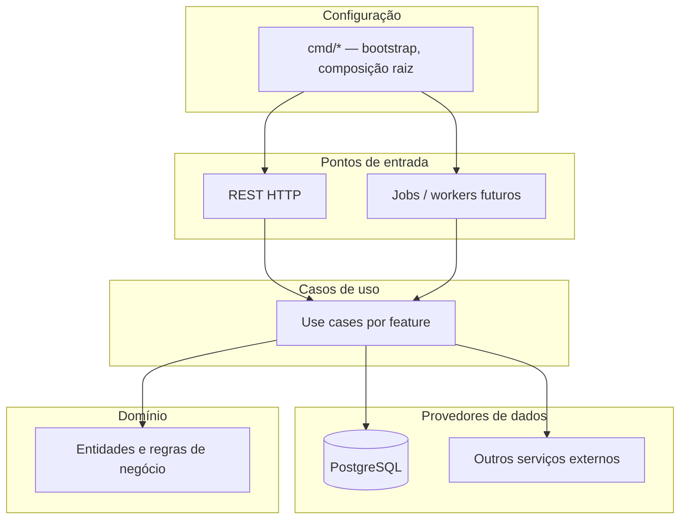

# Especificação da API (backend)

Documento vivo do repositório **`instituto-renata-be`**, alinhado ao produto em **`instituto-renata-fe/docs/SPEC.md`**. O frontend define UX e módulos; este documento define **contratos HTTP, persistência, segurança e arquitetura do servidor**.

## 1. Visão

- **Linguagem:** **Go** (versão mínima e toolchain registadas em `README.md`; ambiente de referência do time documentada no histórico).
- **Base de dados:** **PostgreSQL** — fonte de verdade relacional para tenants, utilizadores, domínio (CRM, vendas, estoque) e metadados de pacotes/features.
- **Função:** API REST (evolução para jobs assíncronos quando necessário) consumida pelo `instituto-renata-fe`.
- **Princípio:** regras de negócio e autorização **no servidor**; o cliente não é fonte de verdade para permissões.

## 2. Arquitetura — Clean Architecture (estilo Uncle Bob)

O projeto segue **Clean Architecture**: dependências de código apontam **sempre para dentro** (domínio no centro). Camadas de referência (alinhadas ao diagrama *Entities → Use Cases → adaptadores externos*):

| Camada | Papel |
|--------|--------|
| **Entidades** | Modelos e invariantes de negócio independentes de framework e de PostgreSQL. |
| **Casos de uso** | Orquestração da aplicação; interfaces (ports) para repositórios e serviços externos. |
| **Pontos de entrada** | Handlers HTTP (REST), futuros workers; traduzem request/response e chamam casos de uso. |
| **Provedores de dados** | Implementações concretas: **PostgreSQL**, clientes HTTP, etc. |
| **Configuração (`cmd/`)** | **Bootstrap**: leitura de config, abertura de conexões, **injeção de dependências** e registo de **módulos por feature** (auth, CRM, vendas, estoque, …). Nada de lógica de negócio aqui — apenas composição. |

**Regra de dependência:** pacotes internos mais centrais **não importam** handlers, drivers SQL nem `main`. Testes unitários focam entidades e casos de uso com ports mockados.

## 3. Estrutura de repositório (diretrizes)

- **`cmd/`** — um ou mais binários (ex.: `cmd/api`). Em cada um: `main`, leitura de env, criação do router/servidor, **wiring** que instancia repositórios PostgreSQL e regista **handlers agrupados por feature** (auth, CRM, vendas, estoque, …).
- **`internal/`** (recomendado) — código não importável por outros módulos Go externos; subpastas por bounded context ou por camada (`domain`, `usecase`, `adapter/http`, `adapter/postgres`, …). A árvore exata será detalhada na Fase 1 do `PLAN.md`.

## 4. Stack técnica

| Componente | Escolha |
|------------|---------|
| Linguagem | **Go** |
| Base de dados | **PostgreSQL** |
| Ambiente / BD | Variável **`ENV`** — seleciona o perfil (local, staging, produção, …) e **condiciona** URL/host, utilizador, senha e restantes parâmetros de ligação; ver §7.2. |
| Migrações | Ferramenta a definir (ex.: `goose`, `migrate`, `atlas`) — registar no histórico ao fixar. |
| API | JSON, UTF-8; prefixo versionado (ex.: `/api/v1`). |
| Auth | JWT assinado ou sessão com cookie seguro — detalhar em revisão; claims mínimos alinhados a §6. |

**Ambiente de desenvolvimento validado (referência):** `go version go1.26.2 darwin/arm64` (ajustar quando o projeto fixar `go` em `go.mod`).

## 5. Features alinhadas ao frontend

O frontend declara **features** contratadas por tenant e **papéis** de utilizador. O backend deve persistir e aplicar as mesmas chaves (nomes estáveis em código e API).

### 5.1 Identificadores de feature (pacotes)

Espelho de `instituto-renata-fe` / `docs/SPEC.md` §5.1:

| Chave | Âmbito no backend |
|-------|-------------------|
| `marketing` | Conteúdo público / captura associada ao pacote (se não for só estático no FE). |
| `crm` | API de contatos, cadastros, interações. |
| `vendas` | API de orçamentos, oportunidades, itens e totais. |
| `estoque` | API de itens, saldos e movimentações. |

### 5.2 Funcionalidades de produto (mapa FE → responsabilidade BE)

| Área no frontend | Rotas / contexto | O que o backend fornece (MVP evolutivo) |
|------------------|------------------|----------------------------------------|
| **Autenticação** | `/login`, sessão | Login, emissão de token/sessão, logout, validação de credenciais, hash de palavra-passe (PostgreSQL). |
| **Área logada + shell** | `/app/*`, menu por feature | Autorização: só dados e rotas dos módulos em `enabledFeatures`; papel `admin` \| `common` para ações sensíveis. |
| **Tela de início (dashboard)** | `/app` (index) | Não é feature à parte: agrega atalhos; opcionalmente endpoint agregador (métricas) mais tarde. |
| **Marketing (público)** | site / landing (Fase 7 FE) | Endpoints apenas se houver formulário dinâmico/CMS; caso contrário pode ficar estático no FE. |
| **CRM** | `/app/crm` | CRUD e listagens de contatos conforme §4.3 do spec do produto. |
| **Vendas** | `/app/vendas` | Orçamentos/oportunidades conforme §4.4. |
| **Estoque** | `/app/estoque` | Itens e movimentações conforme §4.5. |
| **Tema claro/escuro** | — | **Apenas cliente** (localStorage / `data-bs-theme`); **sem** feature de API dedicada. |

### 5.3 Papéis (`role`)

| Valor | Uso |
|-------|-----|
| `admin` | Operações administrativas do tenant (evolução: utilizadores, configurações). |
| `common` | Operação corrente nos módulos autorizados. |

Fonte de verdade: colunas/tabelas em PostgreSQL; claims no token alinhados ao contrato abaixo.

## 6. Contrato de sessão (alinhado ao mock do frontend)

Resposta de login / `GET /me` deve ser compatível com o que o frontend já modela:

- `email` (string)
- `role`: `admin` | `common`
- `enabledFeatures`: array com zero ou mais de: `marketing`, `crm`, `vendas`, `estoque`

*(Nomes exatos dos campos JSON podem seguir `snake_case` na API se convencionado; o FE ajusta o client numa única camada.)*

## 7. PostgreSQL

- **Única fonte relacional** para o MVP (sem replicação obrigatória no desenho inicial).
- Conexão por pool; variáveis de ligação documentadas em `.env.example` (sem segredos versionados).
- Migrações obrigatórias para qualquer alteração de schema em ambientes partilhados.

### 7.1 Desenvolvimento local (Docker)

- Em **execução local**, o PostgreSQL deve ser fornecido via **Docker** (ex.: `docker compose` ou `Compose` com serviço `postgres` definido no repositório quando a base de código existir). Este é o fluxo **padrão** documentado para levantar a BD ao desenvolver.
- Uma instalação nativa de PostgreSQL na máquina do desenvolvedor continua possível, desde que a ligação respeite os mesmos parâmetros acordados para o perfil `local` (ver §7.2).

### 7.2 Variável `ENV` e perfis de ligação

- O serviço deve ler uma variável de ambiente **`ENV`** que identifica o **perfil de ambiente** em que o processo corre (ex.: `local`, `staging`, `production` — conjunto de valores permitidos a fixar no código e a listar no `README` / `.env.example`).
- O valor de **`ENV` condiciona a configuração de acesso ao PostgreSQL**: para cada perfil, o processo utiliza o **URL/host**, **porta**, **utilizador**, **palavra-passe** e **nome da base** (ou equivalente num único `DATABASE_URL`) adequados àquele ambiente — por exemplo credenciais do container em `local` e credenciais geridas no servidor em `production`.
- O mesmo binário deve poder correr em máquina local e em servidores **alterando apenas variáveis de ambiente** (incluindo `ENV` e as credenciais ou URLs associadas ao perfil), sem recompilar para mudar de base de dados.
- A forma exacta de mapear `ENV` → parâmetros (ficheiro de config por ambiente, variáveis com sufixo, ou `DATABASE_URL` distintos por perfil) fica definida na implementação (Fase 1), desde que **`ENV` seja o interruptor documentado** e o contrato de variáveis esteja em `.env.example`.

## 8. Segurança e erros

- HTTPS em produção; senhas com hash forte (Argon2 ou bcrypt).
- **CORS:** permitir apenas as **origens** onde o `instituto-renata-fe` é servido em cada ambiente. O cliente define a URL do API via **`VITE_API_BASE_URL`** (`instituto-renata-fe/docs/SPEC.md` §3.1); o backend deve aceitar pedidos dessa origem quando **`ENV`** (§7.2) corresponder ao mesmo perfil (local vs produção). Não usar `*` em produção.
- Erros JSON: código estável, mensagem segura; sem stack trace ao cliente em produção.
- Códigos HTTP: 401 não autenticado; 403 sem permissão ou feature; 404; 422 validação.

## 9. Observabilidade

- Logs estruturados; correlacionar `request_id` e `tenant_id` quando existirem.

## 10. Processo de atualização e documentação

- Alterações de contrato: atualizar **este ficheiro**, **`docs/PLAN.md`**, **`CHANGELOG.md`** e coordenar com `instituto-renata-fe`.
- **`README.md`:** seguir as mesmas diretrizes do frontend — secção **“Funcionalidades em produção”** apenas para o que estiver **implantado em produção** para o cliente; resto no changelog (ver §11).

### 11. Changelog e README (alinhamento ao frontend)

- **`CHANGELOG.md`:** registo de mudanças notáveis por versão (desenvolvimento e produção), formato inspirado em [Keep a Changelog](https://keepachangelog.com/pt-BR/1.0.0/) e semver quando fizer sentido — **igual em espírito** ao `instituto-renata-fe/CHANGELOG.md`.
- **`README.md`:** documentação técnica (como correr, stack, links para `docs/`); **não** listar como “produção” features ainda em desenvolvimento — espelhar a regra do frontend (`instituto-renata-fe/README.md` e `docs/SPEC.md` §7.1).

## 12. Histórico de revisões

| Data | Alteração |
|------|-----------|
| 2026-04-18 | Versão inicial: Go, PostgreSQL, Clean Architecture, `cmd/` e features alinhadas ao FE; Go 1.26.2 como referência de ambiente. |
| 2026-04-17 | PostgreSQL em Docker para desenvolvimento local; variável `ENV` para perfis de ligação à BD (URL, utilizador, senha, etc.). |
| 2026-04-19 | §8: CORS alinhado ao frontend (`VITE_API_BASE_URL`) e perfis `ENV`. |
